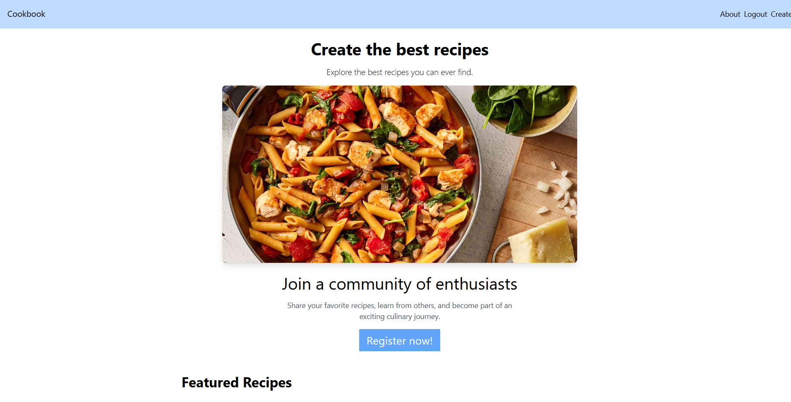

# Welcome to Django Cookbook!

### Requirements
Make sure to have the following installed to run the server
1. Nodejs - the latest lts version
2. Python - v3.13.x

## Get Started
1. Git `clone` or download the repository.
2. Install the packages `python install -r requirements.txt`
3. Install npm packages for tailwind. `python manage.py tailwind install`
4. In the root dir, run `python manage.py migrate` and `python manage.py runserver`
5. Open the link in printed in the console
6. Try the app
